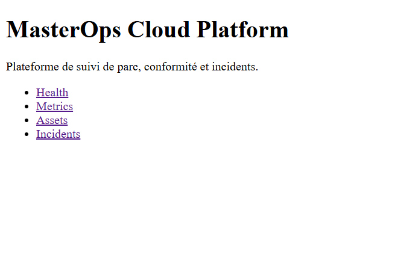
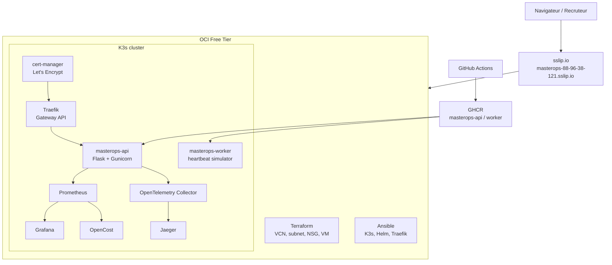
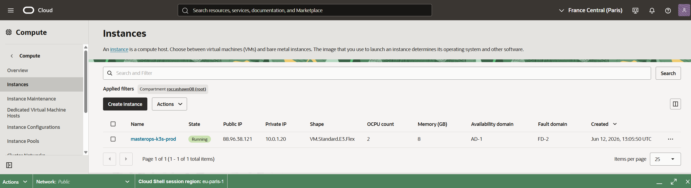
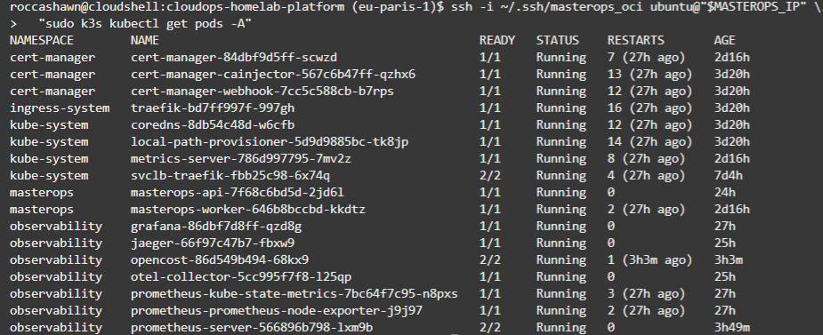
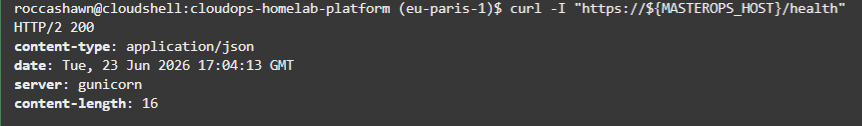
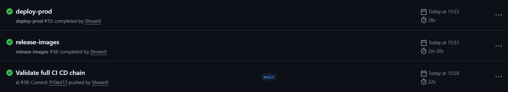
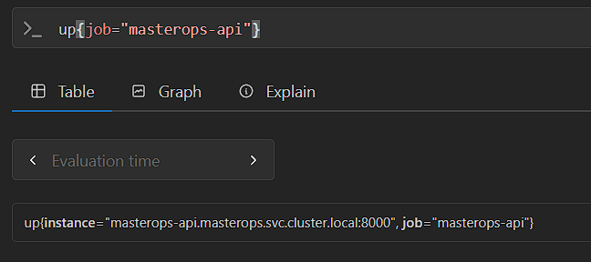
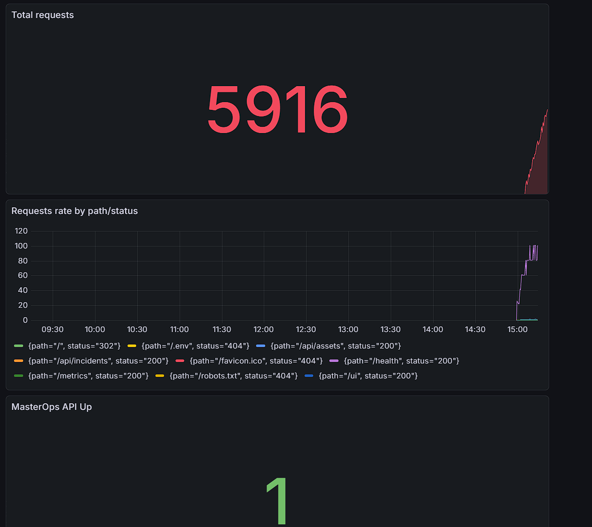
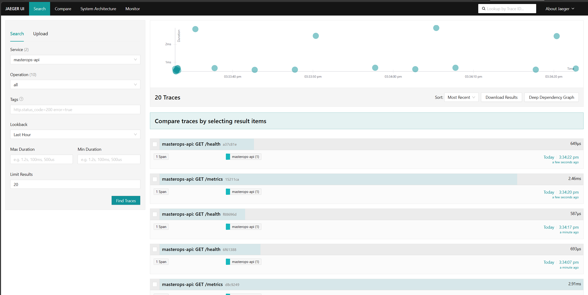
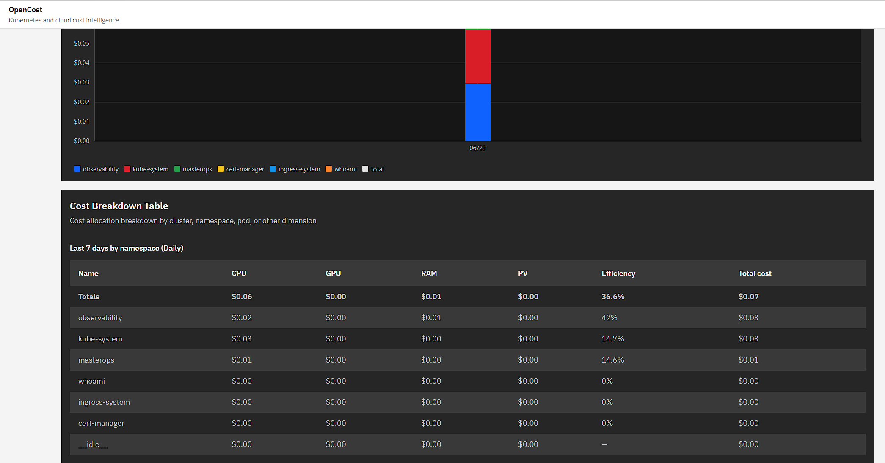

# MasterOps Cloud Platform

MasterOps Cloud Platform est un projet DevOps / Cloud / Infra qui montre une chaine complete, de l'infrastructure jusqu'a l'observabilite.

L'idee n'est pas juste de deployer une application "hello world" dans Kubernetes. Le but est de construire une petite plateforme credible autour d'un sujet que je connais: le suivi de parc, les heartbeats, la conformite et les incidents.

Le projet tourne sur une VM Oracle Cloud Free Tier avec K3s, Traefik Gateway API, cert-manager, GitHub Actions, GHCR, Prometheus, Grafana, OpenTelemetry, Jaeger et OpenCost.

URL publique:

```text
https://masterops-88-96-38-121.sslip.io
```

> Screenshot a ajouter:
>
> ```text
> docs/screenshots/masterops-ui.png
> ```
>
> Capture conseillee: page `https://masterops-88-96-38-121.sslip.io/ui`.



## Pourquoi le projet existe

Je voulais un projet qui montre plus qu'un simple Dockerfile ou un deploiement Kubernetes isole.

Le but de MasterOps est de montrer que je sais assembler plusieurs briques DevOps dans une vraie logique de plateforme:

- provisionner une infrastructure cloud avec Terraform;
- configurer une VM Linux avec Ansible;
- installer un cluster Kubernetes leger avec K3s;
- exposer proprement une application en HTTPS;
- automatiser le build et le deploiement avec GitHub Actions;
- publier des images dans GHCR;
- prouver que l'application tourne avec Prometheus, Grafana, Jaeger et OpenCost;
- documenter les limites et les choix techniques.

Cote fonctionnel, l'application simule une plateforme de gestion de parc:

- des assets;
- des heartbeats;
- des incidents;
- des metriques applicatives;
- une interface web tres simple pour visualiser les points d'entree.

Ce n'est pas une application metier complete, volontairement. Le vrai sujet du projet est l'industrialisation autour de l'application.

## Architecture

Vue simplifiee:



Flux principal:

```text
Utilisateur
  -> https://masterops-88-96-38-121.sslip.io
  -> Traefik Gateway API
  -> HTTPRoute masterops-api
  -> Service masterops-api
  -> Pod Flask/Gunicorn
```

CI/CD:

```text
git push main
  -> ci
  -> release-images
  -> deploy-prod
```

Observabilite:

```text
masterops-api /metrics -> Prometheus -> Grafana
masterops-api traces -> OpenTelemetry Collector -> Jaeger
Kubernetes metrics -> Prometheus -> OpenCost
```

> Screenshot a ajouter:
>
> ```text
> docs/screenshots/architecture.png
> ```
>
> Capture conseillee: schema architecture ou capture du diagramme Mermaid rendu dans GitHub.


## Stack technique

Infrastructure:

- Oracle Cloud Infrastructure Free Tier;
- Terraform;
- backend Terraform OCI Object Storage;
- Ubuntu 22.04;
- K3s single-node;
- Ansible;
- Helm.

Networking / exposition:

- Traefik installe via Helm;
- Gateway API Kubernetes;
- cert-manager;
- Let's Encrypt production;
- sslip.io pour eviter d'acheter un domaine au debut.

Application:

- Python 3.12;
- Flask;
- Gunicorn;
- Prometheus client Python;
- OpenTelemetry instrumentation;
- Docker images multi-arch;
- GHCR.

CI/CD:

- GitHub Actions;
- workflow `ci`;
- workflow `release-images`;
- workflow `deploy-prod`;
- publication GHCR;
- deploiement SSH vers la VM K3s.

Observabilite:

- Prometheus;
- Grafana;
- OpenTelemetry Collector;
- Jaeger;
- OpenCost.

## Structure du repo

```text
.
├── .devcontainer/
├── .github/workflows/
│   ├── ci.yml
│   ├── release.yml
│   └── deploy.yml
├── app/
│   ├── api/
│   │   ├── main.py
│   │   └── requirements.txt
│   ├── tests/
│   └── worker/
├── docker/
│   ├── api.Dockerfile
│   └── worker.Dockerfile
├── infra/
│   ├── ansible/
│   └── terraform/envs/prod/
├── k8s/
│   ├── base/
│   ├── cert-manager/
│   ├── networking/
│   └── observability/
└── README.md
```

## Application

L'application expose quelques routes simples:

```text
GET /health
GET /ui
GET /api/assets
GET /api/incidents
GET /metrics
```

`/health` sert aux probes Kubernetes.

`/metrics` expose les metriques Prometheus.

`/ui` donne une petite page HTML de verification.

Les endpoints API simulent une logique de parc:

- assets;
- incidents;
- etat de sante applicatif.

### Metriques applicatives

Dans `app/api/main.py`, l'application ajoute deux metriques utiles:

```python
REQUESTS = Counter(
    "masterops_http_requests_total",
    "Total HTTP requests",
    ["method", "path", "status"],
)

LATENCY = Histogram(
    "masterops_http_request_duration_seconds",
    "HTTP latency",
    ["path"],
)
```

Ce choix est volontaire: ca permet de voir dans Prometheus et Grafana le nombre de requetes, les statuts HTTP et la latence par route.

Exemples de requetes PromQL:

```promql
up{job="masterops-api"}
sum(rate(masterops_http_requests_total[5m])) by (path, status)
histogram_quantile(0.95, sum(rate(masterops_http_request_duration_seconds_bucket[5m])) by (le, path))
```

## Comment l'infra est provisionnee

L'infrastructure cloud est declaree dans:

```text
infra/terraform/envs/prod/main.tf
infra/terraform/envs/prod/backend.tf
```

Terraform cree:

- un VCN OCI;
- un subnet public;
- un Internet Gateway;
- une route table publique;
- une Security List orientee egress;
- une Network Security Group;
- les regles TCP 22, 80 et 443;
- une VM Ubuntu;
- un boot volume;
- une IP publique;
- une installation initiale K3s via cloud-init.

Extrait important:

```hcl
resource "oci_core_network_security_group_security_rule" "web" {
  for_each = {
    http  = 80
    https = 443
  }

  direction = "INGRESS"
  protocol  = "6"
  source    = "0.0.0.0/0"
}
```

Les ports publics sont volontairement limites a:

- `22` pour SSH;
- `80` pour HTTP / challenge ACME;
- `443` pour HTTPS.

K3s est installe sans le Traefik embarque:

```bash
INSTALL_K3S_EXEC="server --disable traefik --write-kubeconfig-mode=0644"
```

Je desactive le Traefik par defaut de K3s pour installer ma propre version via Helm avec le provider Gateway API active.

> Screenshot a ajouter:
>
> ```text
> docs/screenshots/oci-instance.png
> docs/screenshots/terraform-output.png
> ```
>
> Captures conseillees: VM OCI running avec IP publique, et sortie `terraform output`.



## Comment la VM est configuree

La configuration systeme est geree avec Ansible:

```text
infra/ansible/playbooks/site.yml
infra/ansible/roles/common/
infra/ansible/roles/k3s/
infra/ansible/roles/platform/
```

Le role `common` installe les paquets de base et ouvre les ports avec UFW:

```yaml
- curl
- ca-certificates
- ufw
- git
- jq
- unzip
- htop
```

Le role `k3s`:

- installe K3s;
- demarre le service systemd;
- attend que le node soit pret;
- copie le kubeconfig pour l'utilisateur `ubuntu`.

Le role `platform`:

- installe Helm;
- cree les namespaces `masterops`, `ingress-system`, `observability`;
- installe les CRDs Gateway API;
- ajoute le repo Helm Traefik;
- installe Traefik avec le provider Kubernetes Gateway.

Commande Traefik importante:

```yaml
--set providers.kubernetesGateway.enabled=true
--set gateway.enabled=false
--set service.type=LoadBalancer
--set ports.web.port=8000
--set ports.web.exposedPort=80
--set ports.websecure.port=8443
--set ports.websecure.exposedPort=443
```

Point important que j'ai appris pendant le projet: dans le `Gateway`, il faut utiliser les ports internes de Traefik, donc `8000` et `8443`, meme si le service expose publiquement `80` et `443`.

```yaml
listeners:
  - name: web
    port: 8000
    protocol: HTTP
  - name: websecure
    port: 8443
    protocol: HTTPS
```

> Screenshot a ajouter:
>
> ```text
> docs/screenshots/k3s-pods.png
> ```
>
> Capture conseillee: sortie de `sudo k3s kubectl get pods -A`.



## Exposition HTTPS

L'exposition publique se fait avec:

- Traefik;
- Gateway API;
- cert-manager;
- Let's Encrypt;
- sslip.io.

Le hostname utilise:

```text
masterops-88-96-38-121.sslip.io
```

`sslip.io` permet de faire pointer automatiquement le hostname vers l'IP publique incluse dans le nom.

Le `Gateway` est defini dans:

```text
k8s/networking/gateway.yaml
```

Il contient deux listeners:

- `web` en HTTP;
- `websecure` en HTTPS avec terminaison TLS.

Le certificat est gere par cert-manager avec:

```text
k8s/cert-manager/clusterissuer-prod.yaml
k8s/cert-manager/certificate-prod.yaml
```

Le `ClusterIssuer` utilise Let's Encrypt production:

```yaml
server: https://acme-v02.api.letsencrypt.org/directory
```

Le solver utilise Gateway API:

```yaml
solvers:
  - http01:
      gatewayHTTPRoute:
        parentRefs:
          - name: public-gateway
            namespace: ingress-system
            kind: Gateway
```

Verification TLS:

```bash
curl -I https://masterops-88-96-38-121.sslip.io/health
```

> Screenshot a ajouter:
>
> ```text
> docs/screenshots/tls-health.png
> ```
>
> Capture conseillee: `curl -I` ou navigateur montrant HTTPS valide.



## Comment l'app est build et publiee

Les images sont construites avec Docker et publiees dans GHCR.

Images:

```text
ghcr.io/shvwn9/masterops-api:latest
ghcr.io/shvwn9/masterops-worker:latest
```

Le workflow est:

```text
.github/workflows/release.yml
```

Il se lance apres la reussite du workflow `ci`:

```yaml
on:
  workflow_run:
    workflows:
      - ci
    types:
      - completed
```

Les images sont construites en multi-architecture:

```yaml
platforms: linux/amd64,linux/arm64
```

J'ai garde cette logique car la cible cloud peut varier entre AMD64 et ARM selon les ressources disponibles dans OCI Free Tier.

### Image API

Le Dockerfile API lance Gunicorn avec OpenTelemetry:

```dockerfile
CMD ["opentelemetry-instrument", "gunicorn", "--bind", "0.0.0.0:8000", "--workers", "2", "--access-logfile", "-", "--error-logfile", "-", "main:app"]
```

Ca permet d'avoir automatiquement des traces envoyees vers l'OpenTelemetry Collector.

### Image worker

Le worker tourne avec un utilisateur non-root:

```dockerfile
RUN useradd \
    --system \
    --uid 10002 \
    --create-home \
    worker
```

Il simule un heartbeat toutes les 30 secondes.

## Comment l'app est deployee

Les manifests Kubernetes sont dans:

```text
k8s/base/
k8s/networking/
k8s/cert-manager/
k8s/observability/
```

Le deploiement applicatif contient:

- namespace `masterops`;
- deployment `masterops-api`;
- service `masterops-api`;
- deployment `masterops-worker`;
- HTTPRoute `masterops-api`.

Extrait du deployment API:

```yaml
containers:
  - name: api
    image: ghcr.io/shvwn9/masterops-api:latest
    imagePullPolicy: Always
    env:
      - name: OTEL_SERVICE_NAME
        value: masterops-api
      - name: OTEL_EXPORTER_OTLP_ENDPOINT
        value: http://otel-collector.observability.svc.cluster.local:4318
      - name: OTEL_EXPORTER_OTLP_PROTOCOL
        value: http/protobuf
```

Les probes Kubernetes verifient `/health`:

```yaml
readinessProbe:
  httpGet:
    path: /health
    port: http
livenessProbe:
  httpGet:
    path: /health
    port: http
```

L'exposition se fait via `HTTPRoute`:

```yaml
parentRefs:
  - name: public-gateway
    namespace: ingress-system
    sectionName: websecure
rules:
  - matches:
      - path:
          type: PathPrefix
          value: /
    backendRefs:
      - name: masterops-api
        port: 8000
```

### CD GitHub Actions

Le workflow:

```text
.github/workflows/deploy.yml
```

se lance apres `release-images`:

```yaml
on:
  workflow_run:
    workflows:
      - release-images
    types:
      - completed
```

Il fait:

1. checkout du commit;
2. installation de `envsubst`;
3. preparation de la cle SSH;
4. rendu des manifests avec `MASTEROPS_HOST`;
5. copie des manifests sur la VM;
6. `kubectl apply`;
7. verification du rollout `masterops-api`.

Pourquoi `envsubst` ?

Certains manifests gardent volontairement:

```yaml
hostname: ${MASTEROPS_HOST}
```

Kubernetes ne remplace pas cette variable tout seul. Le workflow genere donc des fichiers temporaires avec la vraie valeur avant de les appliquer.

> Screenshot a ajouter:
>
> ```text
> docs/screenshots/github-actions-chain.png
> ```
>
> Capture conseillee: GitHub Actions montrant `ci -> release-images -> deploy-prod`.



## Comment l'observabilite prouve que ca tourne

L'observabilite est la partie qui transforme le projet en plateforme exploitable.

Elle prouve:

- que l'API repond;
- que les requetes sont mesurees;
- que les traces applicatives arrivent;
- que les couts Kubernetes sont alloues par namespace;
- que le cluster est stable.

## Prometheus

Prometheus scrape l'API via:

```text
http://masterops-api.masterops.svc.cluster.local:8000/metrics
```

Comme j'ai choisi le chart leger `prometheus-community/prometheus`, je n'utilise pas de `ServiceMonitor`. Le scrape applicatif est ajoute via `extraScrapeConfigs`.

Configuration importante appliquee avec Helm:

```yaml
extraScrapeConfigs: |
  - job_name: masterops-api
    metrics_path: /metrics
    scrape_interval: 15s
    static_configs:
      - targets:
          - masterops-api.masterops.svc.cluster.local:8000
```

Requetes utiles:

```promql
up{job="masterops-api"}
masterops_http_requests_total
sum(rate(masterops_http_requests_total[5m])) by (path, status)
histogram_quantile(0.95, sum(rate(masterops_http_request_duration_seconds_bucket[5m])) by (le, path))
```

> Screenshot a ajouter:
>
> ```text
> docs/screenshots/prometheus-masterops-target.png
> ```
>
> Capture conseillee: Prometheus target `masterops-api` en `UP`, ou requete `up{job="masterops-api"}`.



## Grafana

Grafana utilise Prometheus comme datasource:

```text
http://prometheus-server.observability.svc.cluster.local
```

Dashboard conseille:

```text
MasterOps API Overview
```

Panels utiles:

- API up;
- total requests;
- requests by path/status;
- P95 latency;
- CPU node;
- memoire disponible.

Exemples de requetes:

```promql
up{job="masterops-api"}
sum(masterops_http_requests_total)
sum(rate(masterops_http_requests_total[5m])) by (path, status)
100 - (avg by(instance) (rate(node_cpu_seconds_total{mode="idle"}[5m])) * 100)
node_memory_MemAvailable_bytes
```

> Screenshot a ajouter:
>
> ```text
> docs/screenshots/grafana-masterops-api.png
> ```
>
> Capture conseillee: dashboard complet `MasterOps API Overview`.



## OpenTelemetry et Jaeger

Le collector est defini dans:

```text
k8s/observability/otel-collector.yaml
```

Il recoit les traces OTLP:

```yaml
receivers:
  otlp:
    protocols:
      grpc:
      http:
```

Il exporte ensuite vers Jaeger:

```yaml
exporters:
  otlp/jaeger:
    endpoint: jaeger.observability.svc.cluster.local:4317
    tls:
      insecure: true
```

L'API est configuree pour envoyer ses traces au collector:

```yaml
OTEL_EXPORTER_OTLP_ENDPOINT=http://otel-collector.observability.svc.cluster.local:4318
OTEL_EXPORTER_OTLP_PROTOCOL=http/protobuf
```

Ce que je verifie dans Jaeger:

- service `masterops-api`;
- traces sur `/health`;
- traces sur `/api/assets`;
- traces sur `/api/incidents`.

> Screenshot a ajouter:
>
> ```text
> docs/screenshots/jaeger-masterops-api.png
> ```
>
> Capture conseillee: Jaeger avec traces `masterops-api`.



## OpenCost

OpenCost est connecte au Prometheus du namespace `observability`.

Configuration appliquee:

```yaml
opencost:
  exporter:
    defaultClusterId: masterops
  prometheus:
    internal:
      enabled: true
      serviceName: prometheus-server
      namespaceName: observability
      port: 80
    external:
      enabled: false
```

OpenCost remonte ensuite une allocation de couts par namespace:

- `masterops`;
- `observability`;
- `kube-system`;
- `ingress-system`;
- `cert-manager`.

Comme le cluster tourne sur OCI Free Tier, OpenCost utilise un pricing par defaut. Les valeurs sont donc indicatives. Ce qui compte ici, c'est la logique FinOps: montrer comment les couts Kubernetes peuvent etre relies aux namespaces et workloads.

> Screenshot a ajouter:
>
> ```text
> docs/screenshots/opencost-masterops.png
> ```
>
> Capture conseillee: tableau OpenCost avec les namespaces, dont `masterops`.



## Commandes de validation

Verifier l'URL publique:

```bash
curl -i https://masterops-88-96-38-121.sslip.io/health
curl -i https://masterops-88-96-38-121.sslip.io/ui
curl -i https://masterops-88-96-38-121.sslip.io/api/assets
curl -i https://masterops-88-96-38-121.sslip.io/metrics
```

Verifier le cluster:

```bash
sudo k3s kubectl get pods -A
```

Verifier le Gateway:

```bash
sudo k3s kubectl describe gateway -n ingress-system public-gateway
```

Verifier l'application:

```bash
sudo k3s kubectl -n masterops get pods,svc,httproute
sudo k3s kubectl -n masterops rollout status deploy/masterops-api
```

Verifier Prometheus:

```promql
up{job="masterops-api"}
masterops_http_requests_total
```

Verifier Jaeger:

```text
Service: masterops-api
Lookback: Last 1 hour
```

Verifier OpenCost:

```bash
sudo k3s kubectl -n observability get pods,svc | grep -i opencost
```

## Screenshots a fournir

Les captures sont importantes parce que le README doit prouver visuellement que la plateforme tourne.

A ajouter dans:

```text
docs/screenshots/
```

Liste conseillee:

```text
docs/screenshots/masterops-ui.png
docs/screenshots/architecture.png
docs/screenshots/oci-instance.png
docs/screenshots/terraform-output.png
docs/screenshots/k3s-pods.png
docs/screenshots/tls-health.png
docs/screenshots/github-actions-chain.png
docs/screenshots/prometheus-masterops-target.png
docs/screenshots/grafana-masterops-api.png
docs/screenshots/jaeger-masterops-api.png
docs/screenshots/opencost-masterops.png
```

## Problemes rencontres et corrections

Cette partie est importante parce qu'elle montre le raisonnement de debug, pas juste le resultat final.

### Gateway API et Traefik

Au debut, le Gateway etait en port `80`, mais Traefik Helm avait ses entrypoints internes sur `8000` et `8443`.

Erreur observee:

```text
Cannot find entryPoint for Gateway: no matching entryPoint for port 80 and protocol "HTTP"
```

Correction:

```yaml
port: 8000
port: 8443
```

### Variables dans les manifests

Kubernetes ne remplace pas automatiquement:

```text
${MASTEROPS_HOST}
```

Correction:

```bash
envsubst < gateway.yaml > /tmp/gateway.yaml
```

Le workflow GitHub Actions fait maintenant ce rendu avant le deploiement.

### GitHub Actions lancees dans le mauvais ordre

Au debut, `deploy-prod` pouvait partir avant `release-images`.

Correction:

```text
ci -> release-images -> deploy-prod
```

avec `workflow_run`.

### Prometheus leger et ServiceMonitor

Je n'utilise pas `kube-prometheus-stack`, donc pas de `ServiceMonitor`.

Correction:

```yaml
extraScrapeConfigs: |
  - job_name: masterops-api
```

### OpenCost vide

OpenCost cherchait Prometheus dans:

```text
prometheus-system
```

alors que Prometheus etait dans:

```text
observability
```

Correction:

```yaml
namespaceName: observability
serviceName: prometheus-server
```

### Ressources VM

Avec trop peu de RAM/CPU, Prometheus et Grafana rendaient la VM instable.

Correction:

- augmentation des ressources OCI;
- installation d'une stack Prometheus/Grafana plus legere;
- limitation de la retention Prometheus.

## Limites connues

Le projet est volontairement un lab portfolio, pas une plateforme de production HA.

Limites:

- K3s est en single-node;
- la VM est un point unique de panne;
- PostgreSQL n'est pas encore integre comme base persistante;
- les couts OpenCost sont indicatifs car OCI Free Tier n'est pas mappe comme une facturation cloud classique;
- `sslip.io` evite l'achat d'un domaine, mais ce n'est pas le choix final pour une vraie production;
- les dashboards Grafana ne sont pas encore provisionnes en code dans le repo;
- Prometheus et Grafana sont installes via Helm mais les valeurs finales pourraient etre versionnees dans un fichier `k8s/observability/values/`.

Ameliorations possibles:

- ajouter PostgreSQL avec volume persistant;
- ajouter un dashboard Grafana provisionne en JSON;
- versionner les values Helm Prometheus/Grafana/OpenCost;
- ajouter des alertes Prometheus;
- passer sur un vrai nom de domaine;
- ajouter une strategie de backup;
- ajouter une couche GitOps plus propre avec ArgoCD ou Flux.

## Resume recruteur

Ce projet montre une chaine DevOps complete:

```text
Terraform -> Ansible -> K3s -> Traefik Gateway API -> cert-manager -> GitHub Actions -> GHCR -> Kubernetes -> Prometheus/Grafana -> OpenTelemetry/Jaeger -> OpenCost
```

Il montre que je sais:

- provisionner une infra cloud;
- configurer une VM Linux;
- deployer une application dans Kubernetes;
- exposer une application en HTTPS;
- construire et publier des images Docker;
- automatiser un deploiement;
- instrumenter une application;
- lire les metriques, traces et couts;
- documenter les limites de la solution.

Phrase CV possible:

```text
MasterOps Cloud Platform - plateforme IaC hebergee sur OCI Free Tier avec Terraform, Ansible et K3s; CI/CD GitHub Actions avec build Docker multi-architecture, publication GHCR et deploiement SSH automatise; exposition HTTPS via Traefik Gateway API et cert-manager; observabilite Prometheus/Grafana/OpenTelemetry/Jaeger; suivi FinOps Kubernetes avec OpenCost.
```

